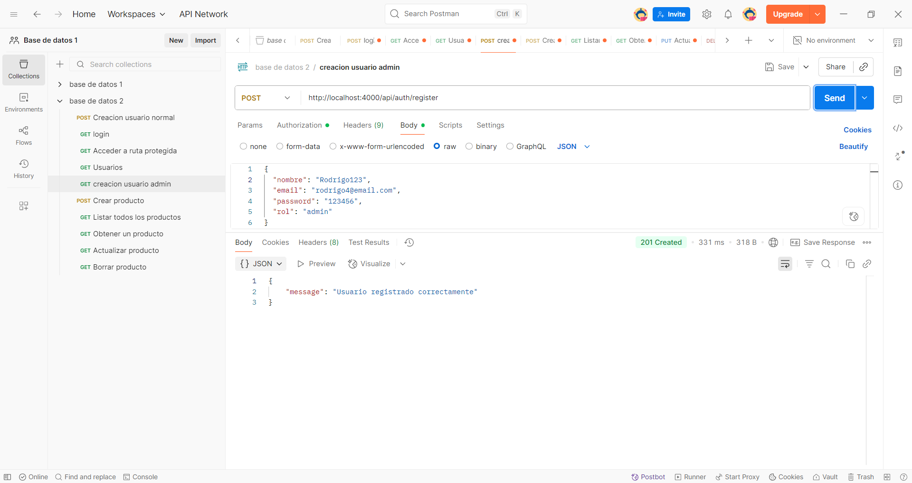
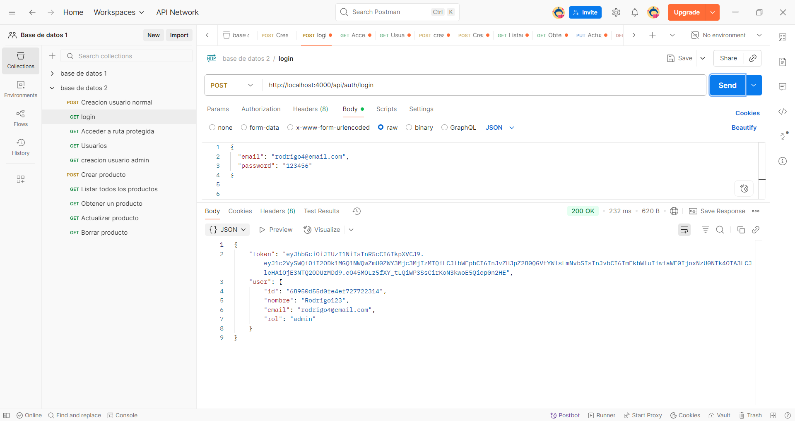
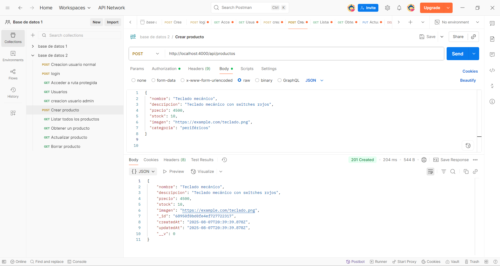
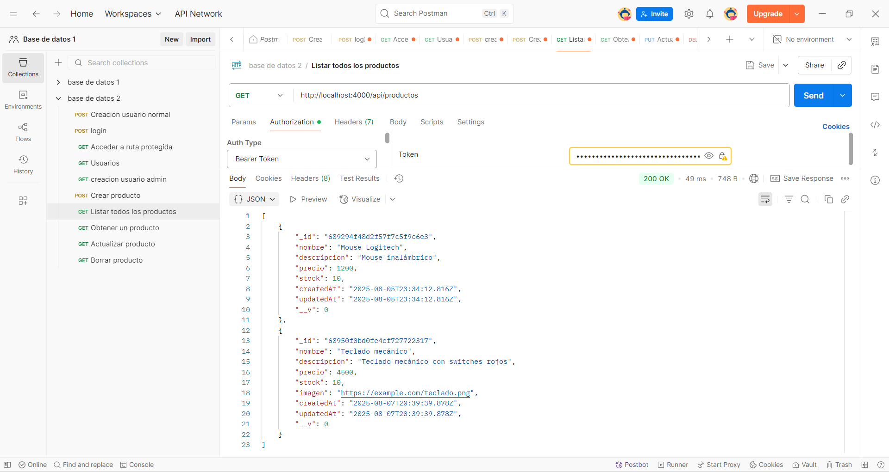
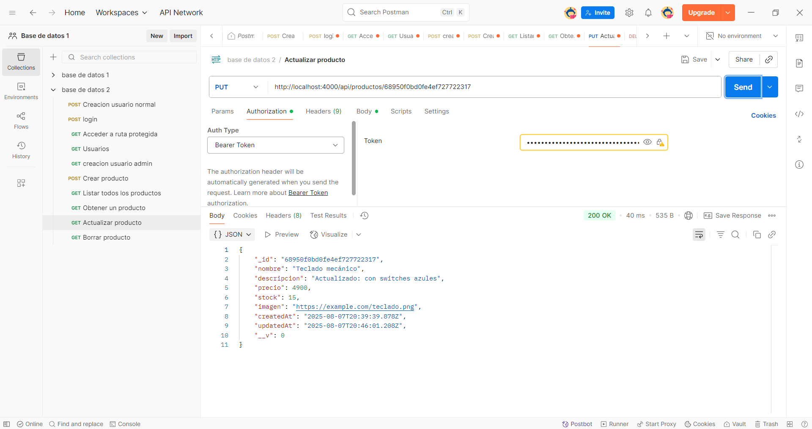
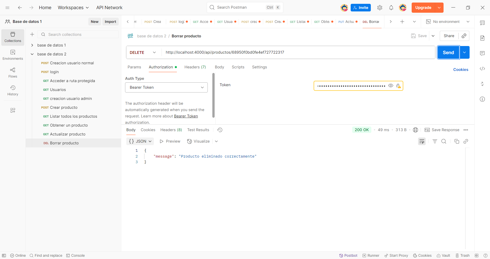

# 🛒 Proyecto Final Backend - Gestión de Productos y Usuarios

Este es un proyecto de backend desarrollado con **Node.js**, **Express**, y **MongoDB** que permite manejar autenticación de usuarios, validación de datos y CRUD de productos con control de acceso por roles.

---

## 🚀 Tecnologías Utilizadas

- Node.js
- Express.js
- MongoDB con Mongoose
- JSON Web Tokens (JWT)
- Bcrypt para hash de contraseñas
- Express Validator para validaciones
- Dotenv
- CORS

---

## 📦 Instalación

1. Clona el repositorio:

```bash
git clone https://github.com/tu_usuario/proyecto-final-backend.git
cd proyecto-final-backend
```

2. Instala las dependencias:

```bash
npm install
```

3. Crea un archivo `.env` con la siguiente estructura:

```env
PORT=4000
MONGO_URL=mongodb://localhost:27017/mi_basededatos
JWT_SECRET=miclavesecreta
```

4. Levanta el servidor:

```bash
npm run dev
```

---

## 📂 Estructura del Proyecto

```
src/
├── controllers/         # Lógica de negocio
├── middlewares/         # Middlewares personalizados (auth, roles, validaciones)
├── models/              # Modelos de Mongoose (User, Product)
├── routes/              # Rutas agrupadas por recursos
├── validators/          # Validaciones con express-validator
├── app.js               # Configuración de middlewares y rutas
├── server.js            # Punto de entrada del servidor
```

---

## 🔐 Autenticación y Autorización

- Registro e inicio de sesión con JWT.
- Rutas protegidas con middleware `verifyToken`.
- Control de acceso por rol usando `isAdmin`.

---

## 🧪 Validación de Datos

Validación usando `express-validator` en:

- Registro de usuario
- Login
- Crear y actualizar producto

---

## 🧾 Rutas Principales

### Auth

- `POST /api/auth/register`
- `POST /api/auth/login`

### Usuarios

- `GET /api/usuarios` (solo admin)
- `GET /api/usuarios/:id`
- `PUT /api/usuarios/:id`
- `DELETE /api/usuarios/:id` (solo admin)

### Productos

- `GET /api/productos`
- `GET /api/productos/:id`
- `POST /api/productos` (solo admin)
- `PUT /api/productos/:id` (solo admin)
- `DELETE /api/productos/:id` (solo admin)

---

## 📬 Postman

## 🧪 Pruebas con Postman

### 1. Registro de usuarios


### 2. Login


### 3. Crear producto


### 4. Listar productos


### 5. Obtener un producto


### 6. Actualizar producto


### 7. Eliminar producto


---

## 👨‍💻 Autor

Rodrigo Vázquez – [GitHub](https://github.com/Rodrivazq)
