# 🛒 Proyecto Final Backend — Gestión de Usuarios, Productos y Compras (Tickets)

API REST en **Node.js + Express + MongoDB** que implementa:
- Autenticación con **JWT**
- Control de acceso por **roles** (usuario/admin)
- CRUD de **productos**
- Flujo de **compra** con **generación de tickets**
- Arquitectura con **DAO / DTO / Repository / Services / Controllers**

---

## 🚀 Tecnologías
Node.js, Express, Mongoose (MongoDB), JWT, Bcrypt, Express-Validator, Dotenv, CORS, Helmet, Morgan, Rate Limit.

---

## 📦 Instalación

```bash
git clone https://github.com/tu_usuario/proyecto-final-backend.git
cd proyecto-final-backend
npm install
```

Crea **.env** en la raíz:
```env
PORT=4000
MONGO_URI=mongodb://127.0.0.1:27017/proyecto-final
JWT_SECRET=claveultrasecreta123
```

Scripts:
```bash
npm run dev   # desarrollo
npm start     # producción
```

---

## 🗂️ Estructura

```
src/
  config/
  controllers/
  services/
  repositories/
  dao/
  dto/
  models/
  middlewares/
  validators/
  routes/
  app.js
  server.js
```

---

## 🔐 Autenticación

- `POST /api/auth/register`
- `POST /api/auth/login`
- `GET /api/protegido/perfil`

### 🧪 Testeo de Autenticación
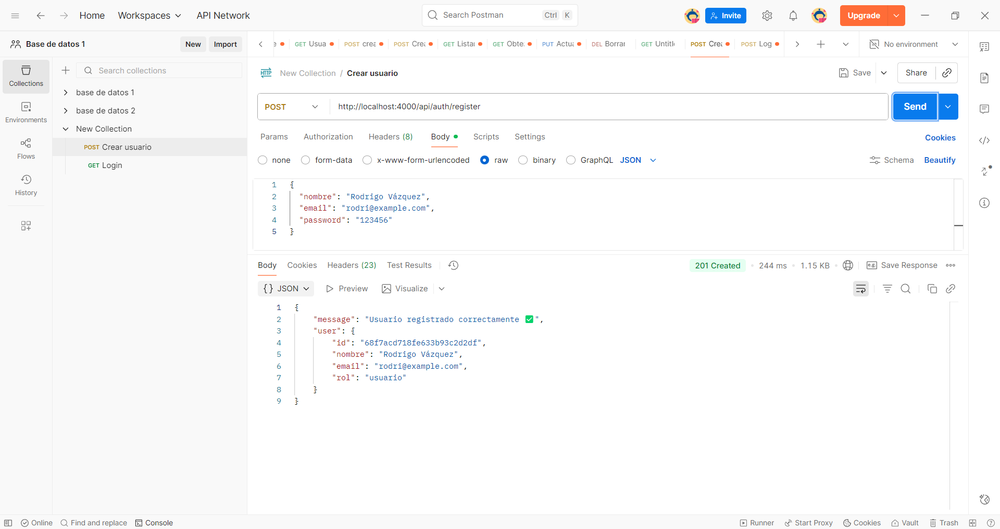
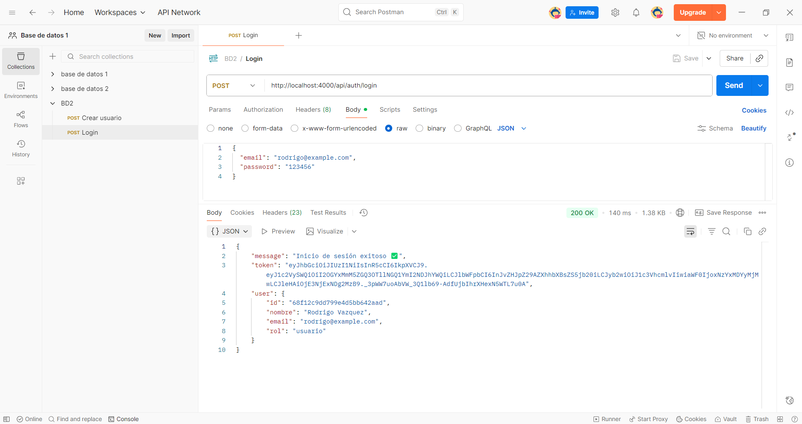
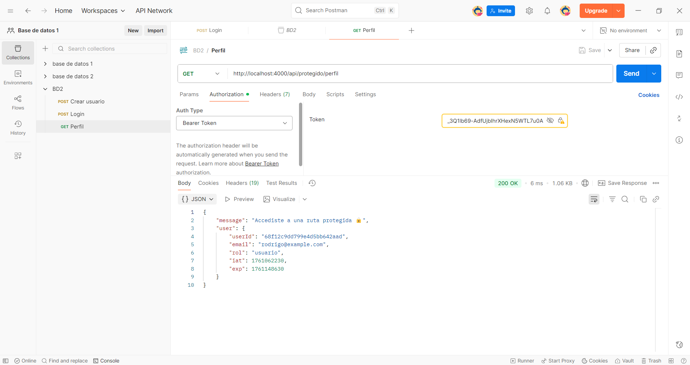
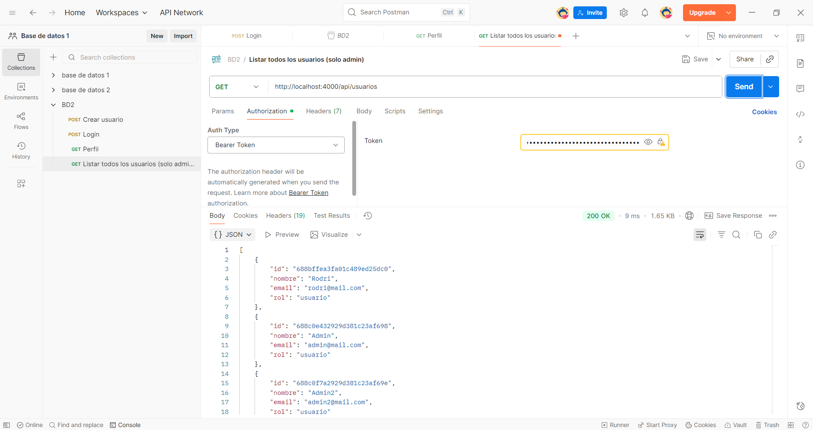
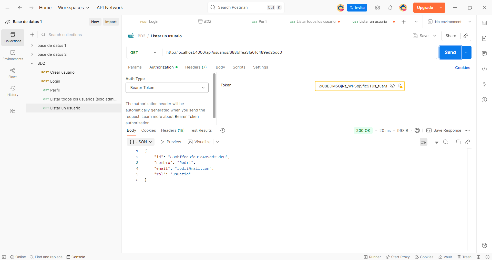
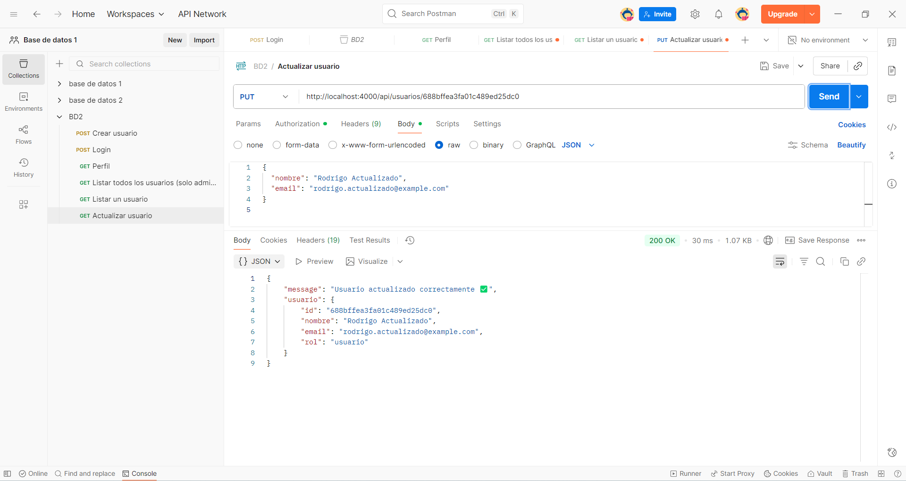
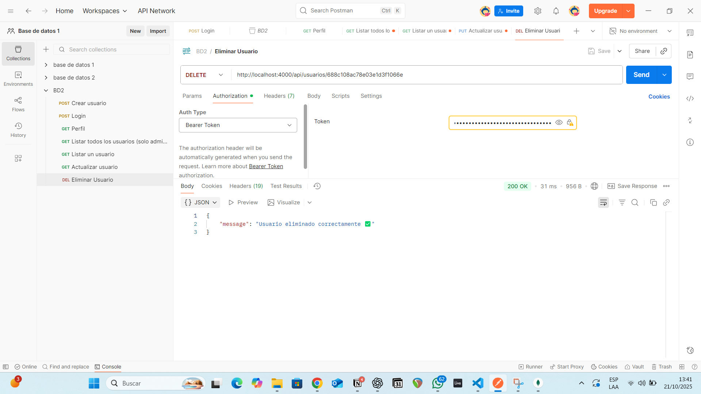

---

## 📦 Productos

Ejemplo:
```json
{
  "title": "Auriculares Bluetooth",
  "description": "Cancelación de ruido",
  "price": 1200,
  "stock": 15,
  "image": "https://ejemplo.com/auriculares.jpg",
  "category": "tecnologia"
}
```

### 🧪 Testeo CRUD Productos
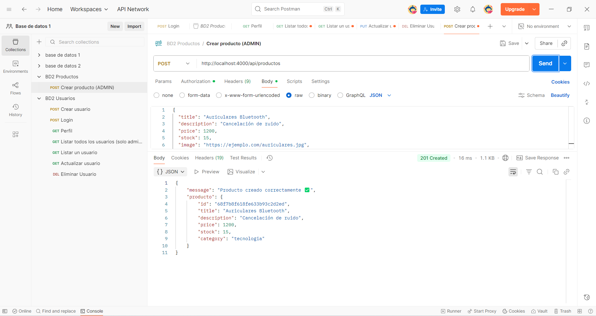
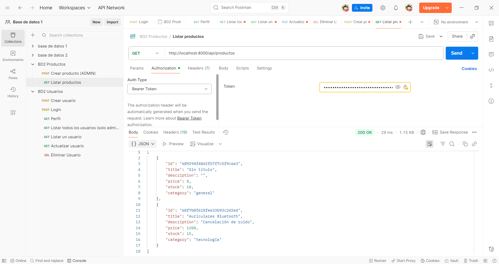
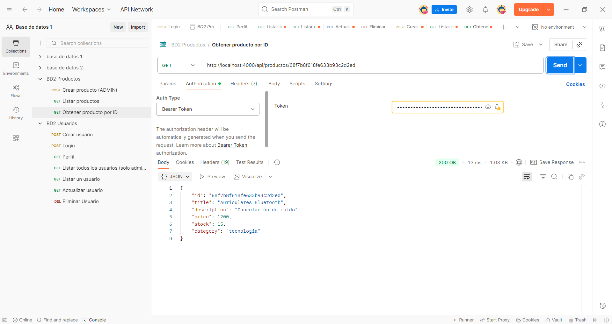
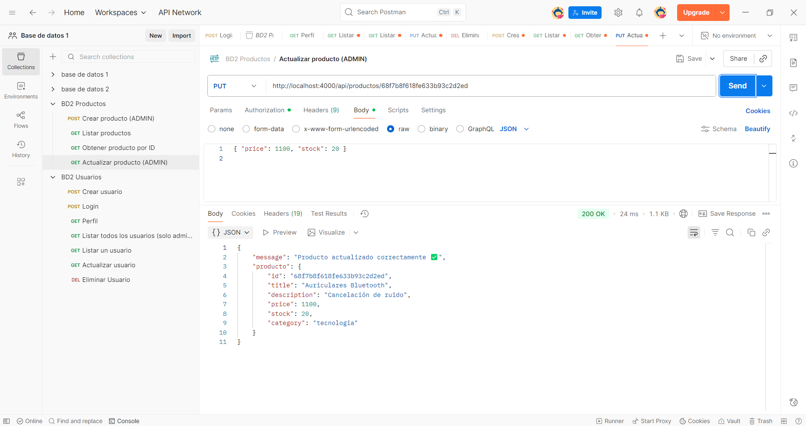
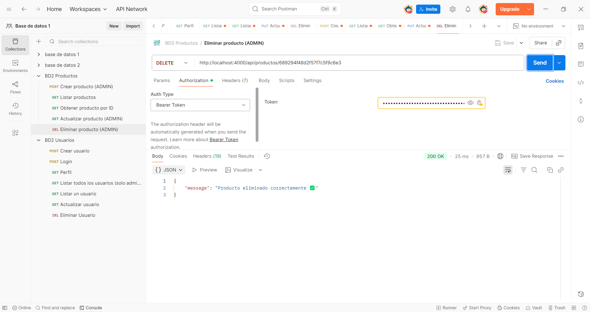

---

## 🧺 Carrito + 💳 Compras (Tickets)

### Flujo:
- Verifica stock
- Descuenta stock
- Genera ticket
- Deja rechazados en carrito (si hay)

### 🧪 Testeo de Compra / Tickets
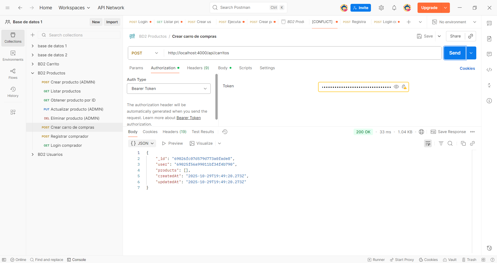
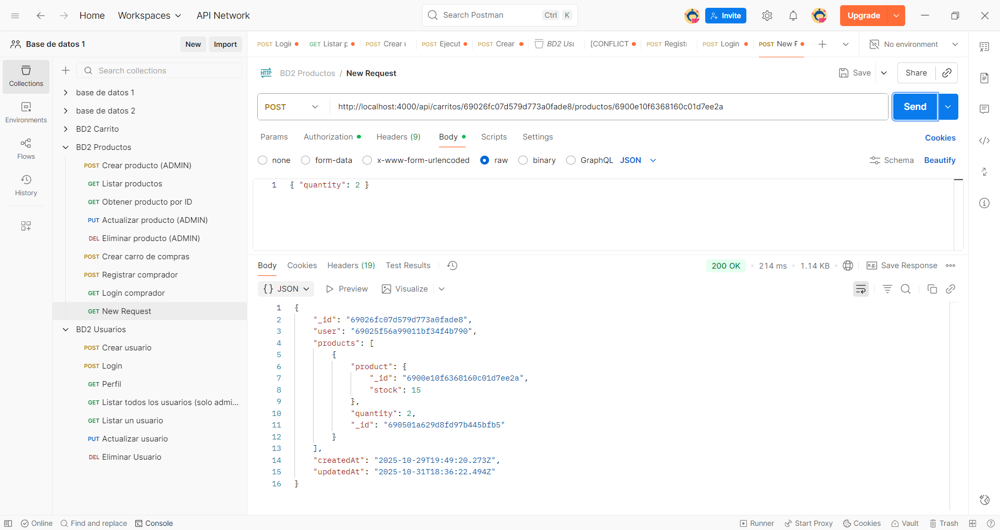
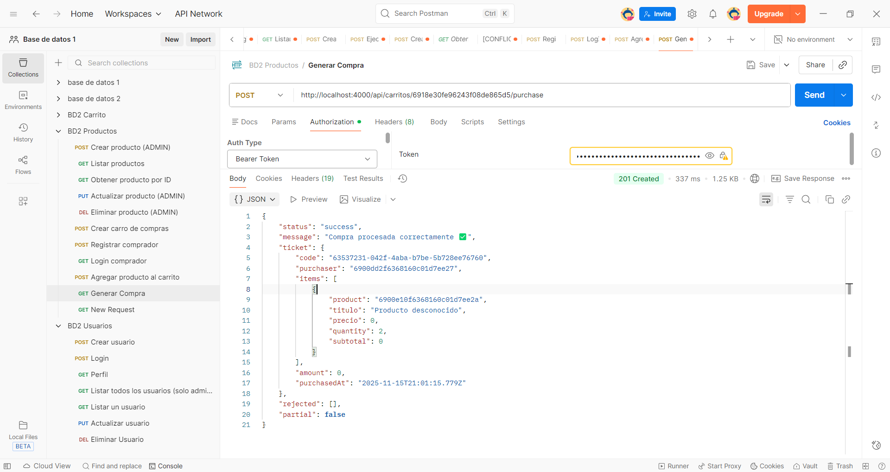
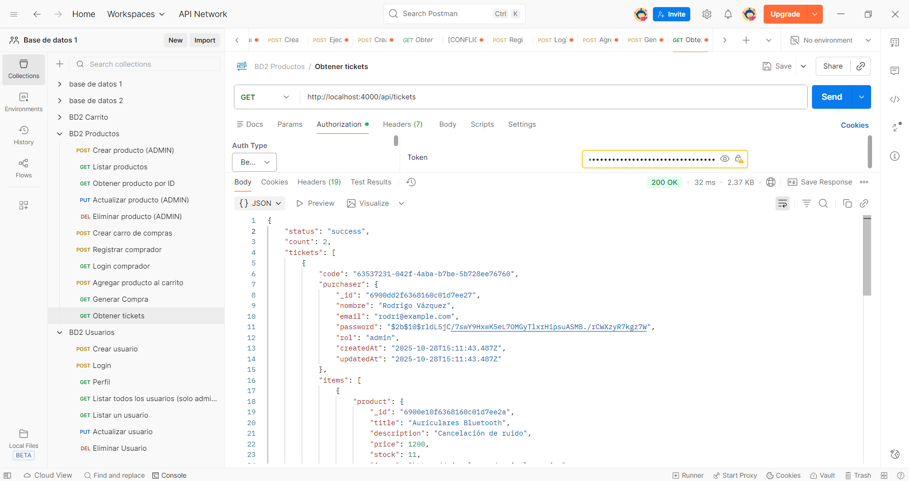

---

## 🧯 Buenas Prácticas
- No subir `.env`
- Manejo uniforme de errores
- DTO evita exponer datos sensibles

---

## 👤 Autor
Rodrigo Vázquez — https://github.com/Rodrivazq
